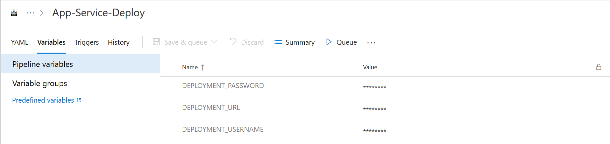
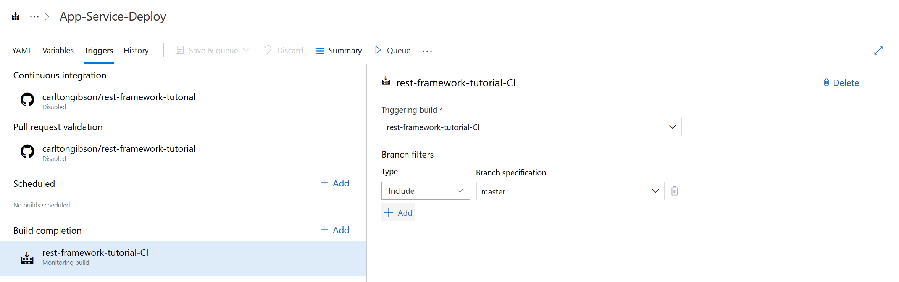

# CI & CD with Azure Pipelines

Here we´ll show how you can set up your Django project to work with Azure DevOps Pipelines.

----

**Setup**

You´ll need a couple of things to get started here:

* An [account with Azure DevOps][devops-account]

    Follow the instructions to create an account, an organisation and a project.
* To [install the Azure Pipelines GitHub App][pipelines-github-app].

    This will allow Azure DevOps Pipelines to connect to your GitHub account and access your source code, as well as the checks API, for reporting build status.

----

With a DevOps project set up, you click to add a _New Pipeline_ in the DevOps UI.

You then select GitHub, and your particular repo as the source for the pipeline and the `YAML` template.

The key point here is that you need to have a `YAML` file defining your pipeline in place before you create the pipeline in the DevOps UI.

The example repo includes the `YAML` files for both a continuous integration (CI) and a continuous deployment (CD) pipeline.


## The CI Pipeline

The CI pipeline is defined in `.azure-pipelines.yml`.

There are a few preliminaries but the core of it is very simple:

```yaml
- script: |
    python -m pip install --upgrade pip setuptools wheel django
    pip install -r requirements.txt
    pip install unittest-xml-reporting
  displayName: 'Install prerequisites'

- script: |
    pushd '$(projectRoot)'
    python manage.py test --testrunner xmlrunner.extra.djangotestrunner.XMLTestRunner --no-input
  condition: succeededOrFailed()
  displayName: 'Run tests'
```

We build the virtul environment from our requirements file and then run `manage.py test` (with a couple of additional arguments for the CI environement).

## The CD Pipeline

The setup of the CD pipeline is more interesting.

The CD pipeline is defined in `.azure-deploy.yml`.

At its core it is just the single `script` step:

```yaml
- script: |
    git push -f "https://$DEPLOYMENT_USERNAME:$DEPLOYMENT_PASSWORD@$DEPLOYMENT_URL" HEAD:master
    env:
        DEPLOYMENT_URL: $(DEPLOYMENT_URL)
        DEPLOYMENT_USERNAME: $(DEPLOYMENT_USERNAME)
        DEPLOYMENT_PASSWORD: $(DEPLOYMENT_PASSWORD)
    displayName: 'LocalGit Deploy'
```

We `git push` the current `HEAD` to the `master` branch at `$DEPLOYMENT_URL`, with credentials `$DEPLOYMENT_USERNAME` and `$DEPLOYMENT_PASSWORD`.

The variables `$DEPLOYMENT_URL`, `$DEPLOYMENT_USERNAME` and `$DEPLOYMENT_PASSWORD` are set as environment variables that are passed into the pipeline.

With those variables in place, the `git push` command is exactly equivalent to the `LocalGit` deployment performed by the VS Code Azure App Service extension when we deployed manually. The only difference is that this time it´s performed automatically in a DevOps Pipeline.

The `env-example` file contains instructions on the `az` commands necessary to set values for the `$DEPLOYMENT_USERNAME` and `$DEPLOYMENT_PASSWORD` variables, as well as how to retrieve the value for the `$DEPLOYMENT_URL`.

### Setting Secret Pipeline Variables

In order to provide the variable values we need to theCD pipeline we need to add them in the DevOps UI.

On the pipeline summary view, click _Edit_ and select the _Variables_ tab:



Here you can add the variables we earier saw in the pipeline YAML. If you tick the lock icon, once saved, variables will be stored in an encrypted format and we not be accessable in plain text. (If you unclick the lock the stored value is not revealed but discarced.)

It´s worth noting, secret variables are obscured in all log output from the pipeline too.

### Setting the pipeline triggers

Finally, we just need to configure the triggers for the CD pipeline.

By default a new pipeline will trigger for all pushes to all branches on the repo. You can also set pipelines to trigger for any pull requests from forks of the repo.

This is what we have set up for the CI pipeline--every time we push a change we want to make sure that the tests pass. But it´s clearly not right for the CD pipeline--there we want to ensure only successful builds on the `master` branch are deployed.

Click the `Triggers` tab.

Here on the Continuous Integration panel we disable continuous integration validation. On the Pull Requests panel we disable pull request validation.

Finally we add a dependency on the successful build completion of the CI pipeline:



We then add a _Branch filter_ making sure that only successful runs on the `master` branch trigger the CD pipeline.

## Next Steps

You can find out more via the official [Use Python in Azure Pipelines](https://aka.ms/AA3gqso) tutorial.


[devops-account]: https://azure.microsoft.com/en-us/services/devops/?nav=min
[pipelines-github-app]: https://github.com/marketplace/azure-pipelines